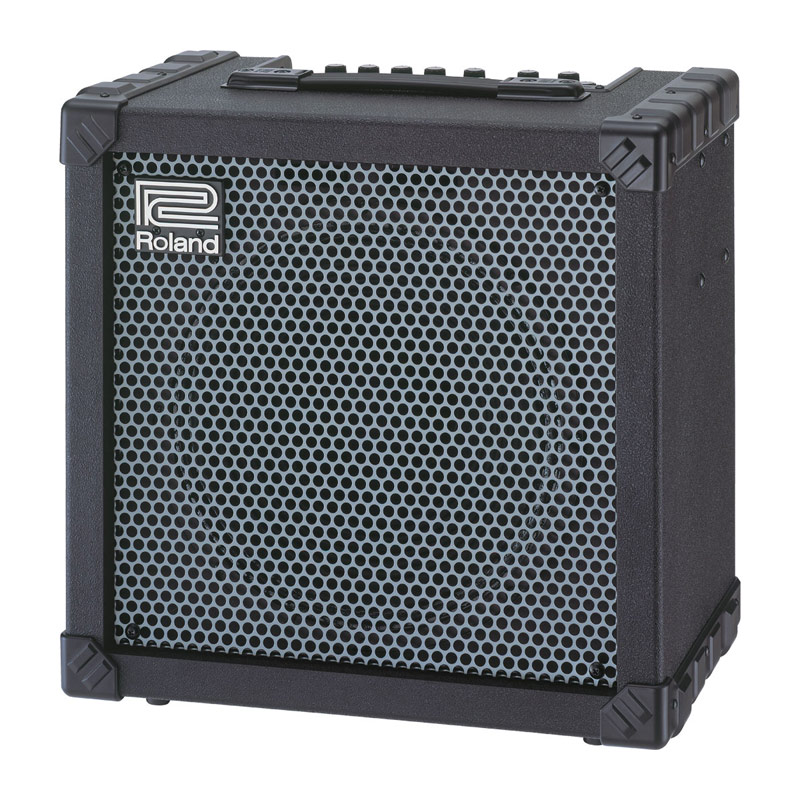
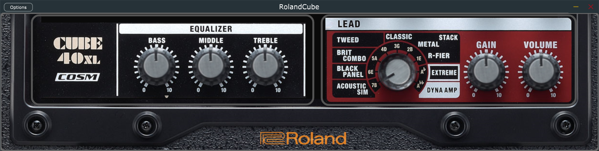

# Roland Cube XL Lead Channel Emulator Plugin

<p align="center">
  
</p>
This plugin is designed to emulate the lead channel behavior and sound characteristics of the renowned Roland Cube XL amplifier using advanced neural networks. Whether you're looking for the distinct overdriven tones or high-gain distortions that the Cube XL's lead channel is famous for, this plugin faithfully reproduces them, providing a versatile and powerful tool for musicians and audio engineers.

## Features
<p align="center">
  
</p>

- **Accurate Lead Channel Emulation**: Utilizes state-of-the-art neural network algorithms to capture the distinct tonal qualities of the Roland Cube XL amplifier's lead channel.
- **Integrated Equalizer**: Includes a built-in equalizer to shape your sound precisely, allowing you to tailor the frequency response to your liking.
- **Versatile Sound Options**: Emulates the full range of tones within the lead channel, allowing for a wide variety of musical styles and applications.
- **User-Friendly Interface**: Intuitive controls that mirror the physical layout of the Roland Cube XL, making it easy to dial in your perfect sound.
- **Low Latency**: Designed to offer real-time performance with minimal latency, ensuring a seamless playing experience.
- **High-Quality Audio**: Supports high-resolution audio to deliver the best possible sound quality.

## Training the Neural Network

The neural network files required for this plugin were developed using a Colab notebook named `train.ipynb`, which is located in the `train` directory. This notebook includes all the necessary scripts and code to preprocess data, train the neural network, and export the trained model files.

# Installation with Cmake
First, install CMake from the official website if you don't have it already: [CMake Download](https://cmake.org/download/).

Once CMake is installed, you can proceed with the setup steps for the plugin.

```bash
# Clone the repository
$ git clone https://github.com/andrewbertax96/RolandCube_Amplifier.git
$ cd RolandCube_Amplifier

# initialize and set up submodules
$ git submodule update --init --recursive

# build with CMake
$ cmake -Bbuild
$ cmake --build build --config Release
```
The binaries will be located in `RolandCube_Amplifier/build/Proteus_artefacts/` <br>
and also the VST in `C:/Program Files/Common Files/VST3/RolandCube.vst3/Contents/x86_64-win`
## Usage

1. **Select the Plugin**: In your DAW, create a new audio track and select the Roland Cube XL Lead Channel Emulator Plugin.
2. **Adjust Settings**: Use the on-screen controls to adjust the gain, EQ, and other settings to match your desired tone.
3. **Play**: Start playing your instrument through the plugin. Experiment with different settings to find the sound that works best for your music.

## Media
- **Demo Video**: A demo of the plugin can be seen at [this site](https://www.youtube.com/watch?v=your_demo_video_url).

## Future Developments

Future updates for this plugin will aim to expand its functionality by including additional modulation effects and reverb types:
- **Modulation Effects**: Chorus, Flanger, Phaser, Tremolo.
- **Reverb Types**: Two different types of reverb to enhance the spatial quality of your sound.

## Credits
A video demonstration of the *Plugin* is available at this [link](https://www.linkedin.com/posts/andres-bertazzi-61952411a_music-coding-engineering-activity-7207376180130316288-_dJX?utm_source=share&utm_medium=member_desktop).
This plugin was developed for the course of Selected Topics under Professor Matthew John Yee-King at [Politecnico di Milano](https://www.polimi.it) (MSc in Music and Acoustic Engineering) by a team of passionate audio engineers and musicians dedicated to bringing the classic sounds of the Roland Cube XL amplifier's lead channel to the digital world.  
<!--
A brief PDF report of the *SYNTH* is available at this [link](https://github.com/andrewbertax96/ACTAM-Synth/blob/main/presentation/ACTAM___Subtractive_Synthesizer.pdf).
-->

